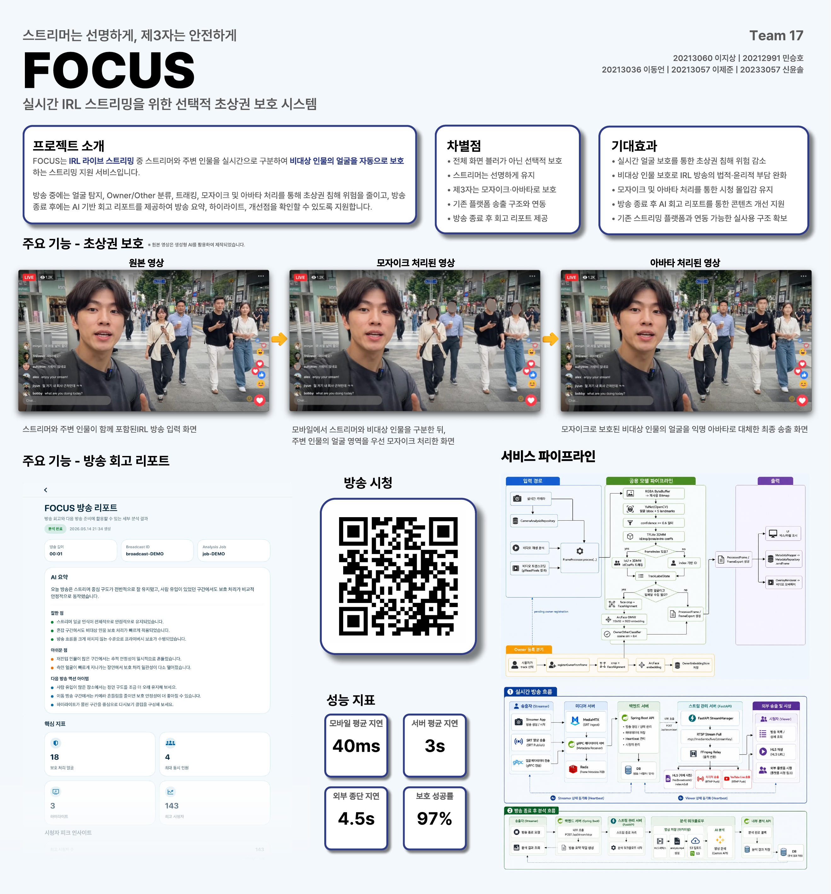
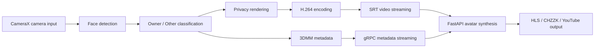
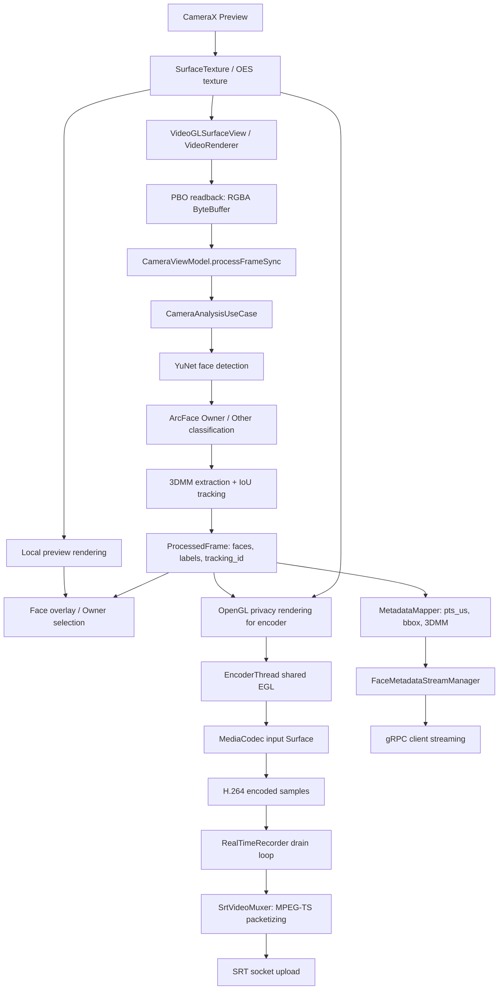

# FOCUS Android

> 스트리머는 선명하게, 제3자는 안전하게
>
> 실시간 IRL 스트리밍을 위한 선택적 초상권 보호 Android 클라이언트

FOCUS Android는 IRL 라이브 방송 중 스트리머 본인은 원본으로 유지하고, 송출 영상에 등장한 제3자의 얼굴은 실시간으로 보호 처리하는 Android 앱입니다. CameraX 기반 카메라 입력, 온디바이스 얼굴 탐지와 Owner/Other 분류, OpenGL 보호 렌더링, H.264 인코딩, SRT 송출, gRPC 메타데이터 전송을 하나의 모바일 방송 흐름으로 연결했습니다.

이 저장소는 FOCUS 팀 프로젝트 중 제가 단독으로 담당한 Android 앱과 Vision 파이프라인에 해당합니다. 전체 FOCUS 시스템은 Android/iOS 클라이언트, Spring Boot 백엔드, FastAPI 아바타 합성 서버, HLS/치지직/유튜브 송출 경로로 구성되며, iOS, 백엔드, 아바타 합성 서버는 다른 팀원이 담당했습니다.

## Portfolio Summary

| 항목 | 내용 |
| --- | --- |
| 문제 | IRL 라이브 방송에서 주변 인물의 얼굴이 의도치 않게 실시간 노출되는 문제 |
| 해결 | 스트리머는 원본으로 유지하고, 제3자 얼굴만 실시간 보호 처리하는 선택적 익명화 앱 구현 |
| 내 기여 | 이 저장소의 Android 구현 전반, 실시간 카메라/렌더링/인코딩/송출 파이프라인, Vision 통합, 서버 연동, 최종 기능 통합 |
| 대표 성과 | KMU-EXPO 우수상, 최종 시연 기준 외부 플랫폼 종단 지연 5초 이내 목표 달성, 보호 성공률 97% |
| 기술 포인트 | CameraX, OpenGL ES, MediaCodec, YuNet, ArcFace, 3DMM, SRT, gRPC, Multi-module Architecture |

## Award

| 항목 | 내용 |
| --- | --- |
| 프로젝트 | FOCUS |
| 행사 | 국민대학교 캡스톤 발표회 KMU-EXPO |
| 수상 | 우수상 |
| 팀 | Team 17 |



## Overview

야외 IRL 방송에서는 행인이나 주변 인물이 의도하지 않게 화면에 포함됩니다. 기존 모자이크나 블러 방식은 개인정보 노출을 줄일 수 있지만, 화면 몰입감을 떨어뜨리고 스트리머 본인까지 보호 대상에 섞일 수 있습니다.

FOCUS는 방송자가 프리뷰 화면에서 본인 얼굴을 Owner로 등록하면 이후 실시간 프레임에서 Owner와 Other를 구분합니다. Owner는 원본 상태로 유지하고, Other 얼굴은 모바일에서 먼저 안전하게 보호 처리한 뒤 서버 아바타 합성에 필요한 최소 메타데이터만 전송합니다.



## Android Internal Data Flow

Android 내부에서는 카메라 프레임을 가능한 한 GPU texture 경로에 유지하고, AI 분석이 필요한 프레임만 RGBA `ByteBuffer`로 읽어옵니다. 분석 결과는 로컬 프리뷰의 얼굴 오버레이와 Owner 선택, 송출용 보호 렌더링, 인코더 입력, 메타데이터 전송에 재사용하고, 송출 프레임과 `pts_us` 동기화를 맞췄습니다.

로컬 프리뷰는 방송자가 Owner를 선택하고 상태를 확인할 수 있도록 원본 프레임 위에 얼굴 오버레이를 표시합니다. 실제 보호 처리는 인코더 입력 Surface에 제출되는 송출 프레임에 적용해, 서버와 외부 플랫폼으로 전달되는 영상에서 Other 얼굴이 먼저 보호되도록 구성했습니다.



## My Role

| 항목 | 내용 |
| --- | --- |
| 이름 | 이지상 |
| 역할 | 팀장, Android 파트 단독 개발, Android 실시간 미디어/Vision 개발, 외부 송출 방향 관리, 전체 기능 통합 |
| 담당 범위 | 이 저장소의 Android 구현 전반, Android 미디어/Vision 모듈 구조 설계, 실시간 카메라/렌더링/녹화, 얼굴 탐지/트래킹/Owner 분류, SRT/gRPC 연동, 방송 생성/시작/종료 서버 API 연동 및 상태 흐름 통합 |
| 비담당 범위 | UI/UX 디자인, iOS 클라이언트, 백엔드, 아바타 합성 서버 구현 |
| 검증 결과 | 모바일 앱, Vision/AI, Streaming 주요 시나리오 검증 완료. 외부 플랫폼 송출 기준 종단 지연 5초 이내 목표 달성 |

## Key Results

| 구분 | 결과 |
| --- | --- |
| 선택적 보호 | 등록된 스트리머는 원본 유지, 비대상 인물은 보호 처리 |
| 모바일 처리 | CameraX 프리뷰부터 얼굴 탐지, 분류, 송출용 보호 렌더링, 인코딩까지 연결 |
| Vision 파이프라인 | YuNet, ArcFace, 3DMM 기반 얼굴 탐지, 인식, 메타데이터 생성 |
| 송출 | SRT 영상 송출과 gRPC 얼굴 메타데이터 스트리밍 병렬 처리 |
| 외부 플랫폼 | 치지직, 유튜브 송출 경로 검증 |
| 지연 목표 | 외부 플랫폼 기준 종단 지연 5초 이내 달성 |
| 시연 지표 | Galaxy S25 기준 모바일 평균 지연 40ms, 서버 평균 지연 3s, 외부 종단 지연 4.5s, 보호 성공률 97% |
| 장시간 방송 | Galaxy S25 약 7시간 연속 방송 테스트에서 발열 외 주요 중단 없이 송출 유지 |
| 테스트 | 77개 단위 테스트 파일, 504개 `@Test`로 주요 mapper/usecase/streaming/vision 로직 검증 |

## Measurement Context

수치 지표는 최종 시연용 Galaxy S25 단말과 외부 송출 경로에서 확인한 값입니다. 장시간 안정성은 실제 약 7시간 연속 방송 테스트로 검증했습니다. 테스트 중 화면에는 매 순간 최소 1명 이상의 얼굴이 있었고, 혼잡 구간에서는 10명 이상이 동시에 등장했습니다. 발열은 있었지만 앱 종료, SRT 송출 중단, gRPC 메타데이터 스트림 중단 없이 방송 흐름을 유지했습니다. 저사양 단말과 이동 통신망 품질 변화는 별도 확장 검증이 필요한 영역으로 남겼습니다.

### Benchmark Device

| 항목 | 내용 |
| --- | --- |
| 측정 기기 | Samsung Galaxy S25 |
| Android baseline | Android 15 이상, `minSdk = 35` |
| 송출 프로파일 | 1280x720, 30fps, H.264, 6Mbps |
| 인원 조건 | 약 7시간 연속 방송 중 매 순간 최소 1명 이상, 혼잡 구간 10명 이상 동시 등장 |
| 측정 범위 | 온디바이스 얼굴 분석, 보호 렌더링, 인코딩, SRT/gRPC 송출이 동시에 동작하는 최종 시연 경로 |
| 해석 | 40ms는 고성능 최신 기기 기준 수치입니다. 낮은 등급 단말에서는 해상도/FPS/model fallback이 필요할 수 있습니다. |

| 지표 | 조건과 해석 |
| --- | --- |
| 모바일 평균 지연 40ms | Galaxy S25 기준, 카메라 입력 이후 얼굴 분석과 송출용 보호 처리까지의 모바일 처리 구간 |
| 서버 평균 지연 3s | 보호 영상과 얼굴 메타데이터를 받은 뒤 서버 아바타 합성 및 출력 준비에 걸린 평균 지연 |
| 외부 종단 지연 4.5s | 모바일 송출부터 치지직/유튜브 출력까지 포함한 최종 시연 지연 |
| 장시간 방송 | Galaxy S25에서 약 7시간 연속 방송을 수행했습니다. 테스트 중 매 순간 최소 1명 이상의 얼굴이 있었고, 혼잡 구간에서는 10명 이상이 동시에 등장했습니다. 발열은 있었지만 앱 종료, 송출 중단, 메타데이터 스트림 중단 없이 유지했습니다. 발열과 배터리 소모는 상용화 전 추가 최적화 대상입니다. |
| 보호 성공률 97% | 최종 시연과 장시간 테스트 중 샘플링한 얼굴 등장 구간 기준입니다. 실패 대부분은 원본 노출이 아니라 Owner를 Other로 판단하거나 보호 영역이 커지는 과보호 케이스였습니다. 실서비스에서는 원본 노출 실패와 과보호 실패를 분리해 관리해야 합니다. |
| `minSdk = 35` | 실시간 보호와 송출 안정성을 우선해 Galaxy S25급 하드웨어 기준으로 단말 범위를 좁혔습니다. 상용화 단계에서는 minSdk 하향, 기기 등급별 해상도/FPS/model fallback, 발열/배터리 최적화가 필요합니다. |

## Technical Decisions

- 영상 보호를 Android에서 먼저 수행했습니다. 서버 합성이나 네트워크가 실패해도 원본 얼굴 픽셀이 서버로 먼저 전달되지 않게 하는 것이 우선순위였습니다.
- 모바일 업링크는 SRT를 사용했습니다. HLS는 시청 배포에는 적합하지만 segment 기반 지연이 있어 모바일 실시간 업로드에는 불리했고, WebRTC는 signaling/peer/media server 범위가 커져 캡스톤 일정 안에서 안정적인 외부 플랫폼 송출까지 검증하기 어려웠습니다.
- 영상과 얼굴 메타데이터를 분리했습니다. H.264 영상은 SRT로 보내고, `session_id`, `pts_us`, `tracking_id`, bbox, 3DMM 정보를 gRPC client streaming으로 전송해 좌표 동기화와 재연결 처리를 독립적으로 관리했습니다.
- 온디바이스 Vision은 경량 모델과 모바일 런타임을 조합했습니다. 초기 검토에서 YOLO/NPU 조합보다 YuNet OpenCV 경로가 프로젝트 장비와 일정 안에서 안정적이었고, ArcFace/3DMM은 작업 특성에 맞춰 ONNX Runtime과 TensorFlow Lite를 함께 사용했습니다.
- SRT ingest 호환을 위해 MPEG-TS packetizer를 직접 구현했습니다. MediaMTX/SRT 경로에서 필요한 PAT/PMT, PES, PTS/PCR, continuity counter, H.264 Annex-B 변환, AAC ADTS header, 1316-byte payload grouping을 Android 쪽에서 처리했습니다.

## Engineering Highlights

- 실시간 카메라 입력, 얼굴 분석, 송출용 보호 렌더링, 인코딩, 송출을 하나의 Android 파이프라인으로 연결했습니다.
- Owner/Other 분류가 불확실하거나 서버 합성에 실패해도 원본 얼굴 노출보다 보호 상태 유지를 우선하도록 설계했습니다.
- 영상 스트림은 SRT로, 얼굴 메타데이터는 gRPC로 분리해 서버 아바타 합성과 좌표 동기화를 처리했습니다.
- 앱 기능을 `core`와 `feature` 모듈로 분리해 AI, 미디어, 네트워크, 방송 도메인을 독립적으로 테스트할 수 있게 구성했습니다.
- 실제 시연 흐름에서 치지직/유튜브 외부 플랫폼 송출까지 검증해 로컬 프로토타입을 넘어 서비스 적용 가능성을 확인했습니다.

## Challenges

- TextureView 기반 구현에서는 렌더링, 분석, 좌표 변환 타이밍이 어긋나 bbox와 보호 영역이 흔들리는 문제가 있었습니다. GLSurfaceView 중심의 동기 처리 흐름과 좌표계 매핑을 분리해 프리뷰 오버레이, 송출 영상, 메타데이터 좌표를 맞췄습니다.
- MediaCodec/EGL/Muxer 연결 초기에 0초 영상이 생성되는 문제가 있었습니다. `System.nanoTime()` 기반 PTS 관리와 `INFO_OUTPUT_FORMAT_CHANGED` 이후 muxer 시작 순서를 보장해 녹화/송출 타임스탬프를 안정화했습니다.
- MediaMTX SRT ingest가 단순 H.264 byte stream이 아니라 MPEG-TS, Annex-B, ADTS, PAT/PMT 재전송, 1316-byte payload grouping을 요구했습니다. Android에서 packetizer/muxer를 구현해 외부 플랫폼 송출까지 연결했습니다.
- 프레임마다 Bitmap을 새로 만들면 GC와 프레임 드랍이 발생했습니다. `BitmapPool`, thread-local buffer, 모듈 분리를 적용해 얼굴 분석과 렌더링이 같은 실시간 경로에서 동작하도록 정리했습니다.
- Owner/Other threshold는 원본 노출 방지와 과보호 사이의 trade-off가 있었습니다. 최종 정책은 원본 노출을 더 큰 실패로 보고, 불확실한 얼굴은 보호 대상에 가깝게 처리하도록 잡았습니다.

## Code Pointers

| 영역 | 코드 |
| --- | --- |
| 방송 카메라 상태 흐름 | [`BroadcastCameraViewModel.kt`](FocusAndroid/feature/broadcast/src/main/java/com/kmu_focus/focusandroid/feature/broadcast/presentation/camera/BroadcastCameraViewModel.kt) |
| 실시간 카메라 분석 | [`CameraAnalysisRepositoryImpl.kt`](FocusAndroid/feature/camera/src/main/java/com/kmu_focus/focusandroid/feature/camera/data/repository/CameraAnalysisRepositoryImpl.kt) |
| 카메라 Surface 연결 | [`CameraScreen.kt`](FocusAndroid/feature/camera/src/main/java/com/kmu_focus/focusandroid/feature/camera/presentation/CameraScreen.kt) |
| OpenGL 보호 렌더링 | [`VideoRenderer.kt`](FocusAndroid/core/media/src/main/java/com/kmu_focus/focusandroid/core/media/data/gl/VideoRenderer.kt) |
| 인코더 Surface 렌더링 | [`EncoderThread.kt`](FocusAndroid/core/media/src/main/java/com/kmu_focus/focusandroid/core/media/data/recorder/EncoderThread.kt) |
| MediaCodec 인코딩/PTS 관리 | [`RealTimeRecorder.kt`](FocusAndroid/core/media/src/main/java/com/kmu_focus/focusandroid/core/media/data/recorder/RealTimeRecorder.kt) |
| 메타데이터 PTS 동기화 | [`CameraMetadataSessionSynchronizer.kt`](FocusAndroid/feature/camera/src/main/java/com/kmu_focus/focusandroid/feature/camera/data/repository/CameraMetadataSessionSynchronizer.kt) |
| 3DMM 추출 | [`TFLiteFacial3DMMDetector.kt`](FocusAndroid/core/ai/src/main/java/com/kmu_focus/focusandroid/core/ai/data/model3dmm/TFLiteFacial3DMMDetector.kt) |
| Owner/Other 분류 | [`OwnerOtherClassifier.kt`](FocusAndroid/core/ai/src/main/java/com/kmu_focus/focusandroid/core/ai/domain/detector/recognition/OwnerOtherClassifier.kt) |
| 얼굴 트래킹 | [`IoU3DMMTracker.kt`](FocusAndroid/core/ai/src/main/java/com/kmu_focus/focusandroid/core/ai/domain/detector/tracking/IoU3DMMTracker.kt) |
| 메타데이터 매핑 | [`MetadataMapper.kt`](FocusAndroid/core/metadata/src/main/java/com/kmu_focus/focusandroid/core/metadata/domain/mapper/MetadataMapper.kt) |
| MPEG-TS packetizer | [`MpegTsPacketizer.kt`](FocusAndroid/core/streaming/src/main/java/com/kmu_focus/focusandroid/core/streaming/data/srt/MpegTsPacketizer.kt) |
| SRT muxer | [`SrtVideoMuxer.kt`](FocusAndroid/core/streaming/src/main/java/com/kmu_focus/focusandroid/core/streaming/data/srt/SrtVideoMuxer.kt) |
| gRPC 메타데이터 스트림 | [`FaceMetadataStreamManager.kt`](FocusAndroid/core/grpc/src/main/java/com/kmu_focus/focusandroid/core/grpc/data/remote/FaceMetadataStreamManager.kt) |

## Core Features

### Owner Registration

방송자는 카메라 프리뷰에서 본인 얼굴을 선택해 Owner로 등록합니다. 등록된 Owner는 이후 실시간 프레임에서 보호 제외 대상으로 판단되고, 등록되지 않았거나 분류가 불확실한 얼굴은 보수적으로 보호 대상에 가깝게 처리합니다.

### Real-time Face Analysis

- OpenCV YuNet 기반 얼굴 bounding box 탐지
- ArcFace 임베딩 기반 Owner/Other 분류
- IoU와 3DMM 정보를 활용한 `tracking_id` 유지
- 다중 얼굴, 얼굴 미탐지, 3DMM 결손 상황에 대한 fallback 처리

### Privacy Rendering

- OpenGL ES 기반 프레임 렌더링
- Other 얼굴 영역을 OpenGL shader 기반 privacy mask로 보호합니다. 코드의 `Mosaic` 모드는 픽셀 모자이크가 아니라 shader mask 모드이며, `Avatar`, `Mosaic`, `Original` 설정에 따라 3DMM 추출과 송출 보호 적용 범위를 제어합니다.
- 로컬 프리뷰는 Owner 선택과 상태 확인을 위한 얼굴 오버레이를 표시하고, 보호 처리는 인코더 입력과 SRT 송출 프레임에 적용
- 서버 합성 실패 또는 네트워크 오류 시에도 원본 노출보다 보호 상태 유지를 우선

### Live Streaming

- 기본 송출 프로파일: 1280x720, 30fps, H.264, 6Mbps
- MediaCodec 기반 H.264 인코딩
- MPEG-TS packetizer 직접 구현
- SRT socket 기반 업로드
- 방송 시작/종료 API 상태와 실제 송출 상태를 분리해 관리

### Metadata Streaming

서버 아바타 합성이 영상 좌표계와 동기화될 수 있도록 프레임 단위 얼굴 메타데이터를 전송합니다.

- gRPC client streaming 기반 메타데이터 전송
- Protobuf Lite 사용
- `session_id`, `pts_us`, 프레임 크기, 회전/미러 여부, `tracking_id`, 얼굴 bbox, 3DMM 계수 매핑
- 빈 얼굴 프레임, 3DMM 누락, 스트림 종료 케이스 테스트

### App & Server Integration

- 카카오 로그인 및 자동 로그인 세션 관리
- JWT access/refresh token 저장, 인증 인터셉터, 토큰 갱신
- 방송 생성, 시작, 종료, 삭제, 상세/목록 조회
- 치지직/유튜브 채널 연동 상태 조회, 연결 URL 요청, 연결 해제
- 방송 종료 후 분석 작업 polling 및 회고 리포트 표시

## Android Flow

```text
카카오 로그인
  -> 방송 생성
  -> 카메라 프리뷰 시작
  -> 프리뷰 터치로 Owner 얼굴 등록
  -> 실시간 얼굴 탐지
  -> Owner/Other 분류
  -> Other 얼굴 송출용 보호 렌더링
  -> H.264 인코딩
  -> SRT 영상 송출
  -> gRPC 얼굴 메타데이터 전송
  -> 방송 종료
  -> 회고 리포트 조회
```

## Privacy Design

이 프로젝트의 핵심 설계 원칙은 원본 얼굴 노출을 최소화하는 것입니다.

- Owner는 사용자가 직접 프리뷰에서 선택해 등록합니다.
- 등록되지 않았거나 분류가 불확실한 얼굴은 보호 대상에 가깝게 처리합니다.
- 서버 아바타 합성 전에도 Other 얼굴은 Android에서 먼저 보호 처리합니다.
- 서버에는 원본 얼굴 픽셀 대신 보호 처리된 영상과 합성용 메타데이터를 전달합니다.
- 3DMM 메타데이터는 원본 픽셀이나 얼굴 텍스처가 아니라 아바타 정합에 필요한 제한된 계수 정보만 사용합니다.
- 다만 얼굴 구조를 담은 정보이므로 생체정보에 준해 민감하게 취급하고, Owner 정보는 서버 전송 대상에서 제외하며 Other 합성에 필요한 최소 필드만 보냅니다.
- 네트워크 오류, 서버 합성 실패, 3DMM 추출 실패 상황에서도 보호 상태 유지를 우선합니다.

## Repository Scope

```text
FocusAndroid/
├── app/                    # 앱 진입점, 테마, 최상위 화면 조합
├── core/
│   ├── ai/                 # 얼굴 탐지, 트래킹, Owner 인식, 3DMM 추출
│   ├── grpc/               # 얼굴 메타데이터 gRPC 전송
│   ├── media/              # OpenGL 렌더링, 녹화, muxer, frame processor
│   ├── metadata/           # 프레임 메타데이터 모델과 JSON 저장
│   ├── network/            # Retrofit, 인증 인터셉터, 토큰 갱신
│   ├── session/            # 인증 세션 상태 관리
│   ├── streaming/          # SRT socket, MPEG-TS packetizer
│   └── ui/                 # 공통 Compose UI, inset 처리
└── feature/
    ├── account/            # 사용자 정보, 플랫폼 연동
    ├── auth/               # 카카오 로그인, 인증 세션
    ├── broadcast/          # 라이브 방송 생성/시작/종료/리포트
    ├── camera/             # 카메라, Owner 등록, 녹화 제어
    ├── metadatareview/     # 영상 + 메타데이터 리뷰
    └── video/              # 로컬 영상 분석, 재생, 저장
```

## Android Tech Stack

아래 기술 스택은 이 Android 저장소 기준입니다. 이 저장소에서 확인할 수 있는 Android 구현은 제가 담당했으며, iOS, 백엔드, 아바타 합성 서버는 별도 저장소/파트에서 다른 팀원이 구현했습니다.

| 영역 | 사용 기술 |
| --- | --- |
| Language | Kotlin 2.0.21 |
| UI | Jetpack Compose, Material 3 |
| Architecture | Multi-module, MVVM, Clean Architecture style |
| DI | Hilt, KSP |
| Camera/Media | CameraX, MediaCodec, Media3 ExoPlayer, OpenGL ES |
| AI/CV | OpenCV, ONNX Runtime, TensorFlow Lite |
| Recognition | YuNet, ArcFace, 3DMM |
| Network | Retrofit, OkHttp, Gson |
| Streaming | SRT, MPEG-TS |
| RPC | gRPC, Protobuf Lite |
| Auth | Kakao SDK, JWT token refresh |
| Test | JUnit, MockK, kotlinx-coroutines-test, MockWebServer |

## Validation

프로젝트 시연과 테스트를 통해 다음 흐름을 검증했습니다.

| 구분 | 검증 내용 | 결과 |
| --- | --- | --- |
| 모바일 앱 | 카카오 로그인, 방송 생성, Owner 등록, 얼굴 탐지, Owner/Other 구분 | 성공 |
| 보호 처리 | Other 얼굴 privacy mask, 다중 얼굴 보호, 보호 영상 저장 | 성공 |
| Vision/AI | YuNet 얼굴 탐지, tracking_id 유지, 3DMM 계수 생성, bbox 좌표 정합 | 성공 |
| 송출 | SRT 송출, 치지직/유튜브 플랫폼 출력, A/V 싱크 확인 | 성공 |
| 안정성 | 네트워크 장애와 서버 합성 실패 시 보호 상태 유지, Galaxy S25 약 7시간 연속 방송 유지 | 성공 |
| 테스트 코드 | 77개 단위 테스트 파일, 504개 `@Test` | 주요 단위 검증 범위 확보 |

## Run

Android Studio에서는 저장소 루트가 아니라 `FocusAndroid/` 디렉터리를 프로젝트로 엽니다.

### Requirements

- Android Studio
- JDK 17
  - Java/Kotlin target 11
- Android SDK 36
- Android 15 이상 기기 또는 에뮬레이터
  - `minSdk = 35`
  - 실시간 보호와 송출 안정성을 우선해 높은 하드웨어 baseline으로 설정
  - 카메라, 마이크, 로컬 영상 접근 권한 필요
- 백엔드 API 서버
- gRPC 메타데이터 서버
- MediaMTX 또는 SRT 호환 스트리밍 서버
- 카카오 Android 앱 키
- 치지직/유튜브 OAuth 설정

### Local Properties

`FocusAndroid/local.properties`에 다음 값을 설정합니다.

```properties
sdk.dir=/Users/<user>/Library/Android/sdk

# Required
serverBaseUrl=https://api.example.com/
mediaMtxHost=stream.example.com
mediaMtxPort=<srt-port>

# Kakao
kakaoNativeStringAppKey=<kakao-native-app-key>

# Optional: omitted values fall back to serverBaseUrl host, 443, true
grpcServerHost=api.example.com
grpcServerPort=443
grpcUseTls=true

# CHZZK OAuth
chzzkClientId=<chzzk-client-id>
chzzkRedirectUri=https://api.example.com/api/v1/platforms/chzzk/callback
chzzkAuthBaseUrl=https://chzzk.naver.com/account-interlock

# YouTube OAuth
youtubeClientId=<youtube-client-id>
youtubeRedirectUri=https://api.example.com/api/v1/platforms/youtube/callback
youtubeAuthBaseUrl=https://accounts.google.com/o/oauth2/v2/auth
```

주의 사항:

- `serverBaseUrl`은 반드시 `/`로 끝나야 합니다.
- `serverBaseUrl`, `mediaMtxHost`, `mediaMtxPort`가 없으면 Gradle 설정 단계에서 빌드가 실패합니다.
- OAuth client id, redirect uri, Kakao app key가 비어 있으면 로그인/플랫폼 연동 기능은 정상 동작하지 않습니다.
- API base URL, OAuth 키, SRT 서버 정보는 커밋하지 않고 `local.properties`에서만 관리합니다.

### Build

```bash
cd FocusAndroid
./gradlew :app:assembleDebug
./gradlew :app:installDebug
```

### Test

```bash
cd FocusAndroid
./gradlew testDebugUnitTest
./gradlew connectedDebugAndroidTest
```

## Notes

- AI 모델 파일은 `core/ai/src/main/assets/`에 포함되어 있으며 약 18MB입니다.
- 라이브 방송 입력 프로파일은 `feature/broadcast/src/main/java/com/kmu_focus/focusandroid/feature/broadcast/domain/config/BroadcastSrtInputProfile.kt`에 정의되어 있습니다.
- 아바타 합성과 Gemini 기반 회고 리포트 생성은 Android 앱 내부가 아니라 FastAPI 서버 담당 기능입니다.
- Galaxy S25 약 7시간 연속 방송 테스트에서 매 순간 최소 1명 이상의 얼굴이 있었고, 혼잡 구간에서는 10명 이상이 동시에 등장했습니다. 발열 외 주요 중단은 없었지만, 발열 완화와 배터리 소모 최적화는 후속 개선 과제입니다.
- 저사양 단말과 이동 통신망 품질 변화에 따른 지연 변동은 추가 검증이 필요합니다.
